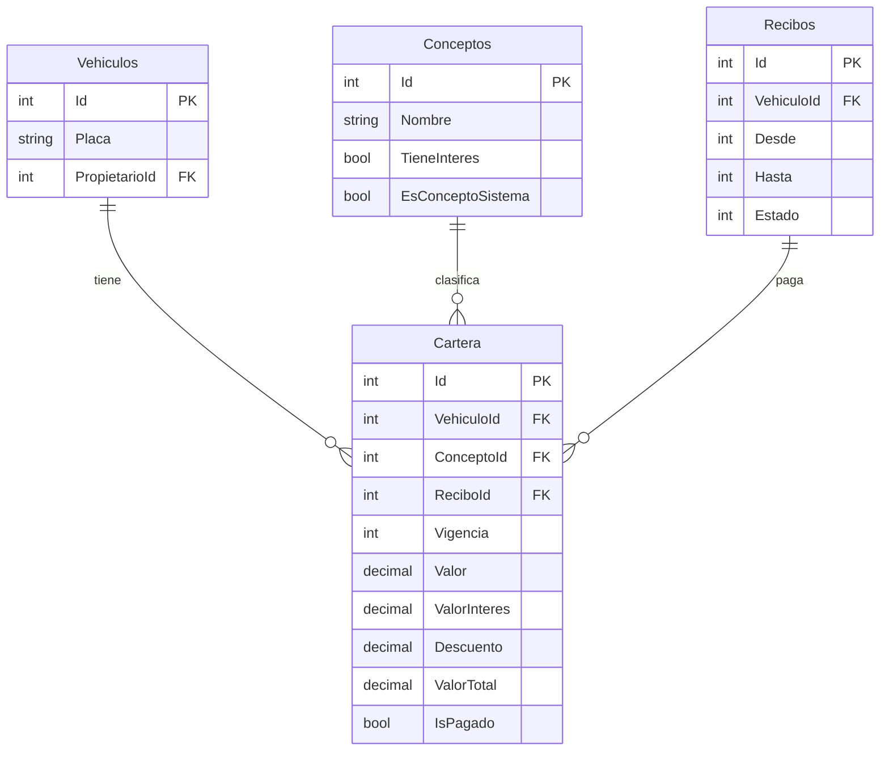

# Secuencia principal - impuesto vehicular

Este flujo describe la version nueva que se esta migrando a Entity Framework: la UI consulta datos, los services aplican reglas de negocio, y PostgreSQL queda como persistencia con llaves foraneas, no como dueño de la logica.

```mermaid
sequenceDiagram
    actor Funcionario
    participant UI as UI Blazor
    participant Vehiculos as VehiculosService
    participant Liquidacion as LiquidacionService
    participant Pagos as PagosService
    participant Coactivo as CoactivoService
    participant EF as MainDataContext / EF Core
    database DB as PostgreSQL RodamientoDb

    Funcionario->>UI: Busca placa
    UI->>Vehiculos: Consultar vehiculo por placa
    Vehiculos->>EF: Vehiculos + Propietario + Catalogos
    EF->>DB: SELECT con relaciones
    DB-->>EF: Vehiculo normalizado
    EF-->>Vehiculos: Entidad / DTO
    Vehiculos-->>UI: Datos del vehiculo y propietario

    Funcionario->>UI: Genera cartera hasta vigencia
    UI->>Liquidacion: GenerarCarteraVehiculoAsync(placa, desde, hasta)
    Liquidacion->>EF: Cargar vehiculo, parametros, tarifas, estados
    EF->>DB: SELECT Vehiculos, Parametros, Tarifas, EstadoProcesos
    Liquidacion->>EF: Eliminar cartera pendiente del rango
    EF->>DB: DELETE Cartera no pagada del rango
    loop Por cada vigencia
        Liquidacion->>Liquidacion: Calcular rodamiento, carga/pasajeros, estampillas y costas
        Liquidacion->>EF: Agregar Cartera por concepto
    end
    EF->>DB: INSERT Cartera
    Liquidacion-->>UI: Cartera generada

    Funcionario->>UI: Liquida deuda
    UI->>Liquidacion: LiquidarDeudaPorConceptosAsync(placa, hasta)
    Liquidacion->>EF: Consultar cartera pendiente
    EF->>DB: SELECT Cartera
    Liquidacion->>Liquidacion: Calcular intereses, descuentos y sistematizacion
    Liquidacion-->>UI: Resumen por vigencia y concepto

    Funcionario->>UI: Genera recibo
    UI->>Liquidacion: GenerarReciboAsync(placa, cedula, tipoDocumento, desde, hasta)
    Liquidacion->>EF: Anular recibos pendientes previos
    EF->>DB: UPDATE Recibos
    Liquidacion->>EF: Crear nuevo recibo pendiente
    EF->>DB: INSERT Recibos
    Liquidacion-->>UI: ReciboId

    Funcionario->>UI: Aplica pago
    UI->>Pagos: AplicarPagoReciboAsync(reciboId)
    Pagos->>EF: Cargar recibo, vehiculo y cartera del rango
    EF->>DB: SELECT Recibos, Vehiculos, Cartera
    Pagos->>EF: Marcar cartera pagada, recibo cancelado y PagoHasta
    EF->>DB: UPDATE Cartera, Recibos, Vehiculos
    Pagos-->>UI: Pago aplicado

    alt Deuda vencida sin pago
        Funcionario->>UI: Genera proceso persuasivo/coactivo
        UI->>Coactivo: Crear proceso desde cartera pendiente
        Coactivo->>EF: Agrupar deuda por vehiculo y vigencias
        EF->>DB: SELECT Cartera no pagada
        Coactivo->>EF: Crear Proceso y marcar cartera en coactivo
        EF->>DB: INSERT Procesos / UPDATE Cartera
        Coactivo-->>UI: Proceso creado
    end
```

## Conceptos: tabla y enum

`Conceptos` debe seguir siendo tabla cuando el dato sea catalogo: nombre visible, parametrizacion, valores reportables, cambios administrativos o relacion por FK desde `Cartera`.

El enum no reemplaza la tabla. El enum sirve para los conceptos reservados del sistema que la logica necesita reconocer sin usar textos quemados:

- `Rodamiento = 1`
- `Estampillas = 2`
- `Costas = 3`
- `Carga = 4`
- `Sancion = 6`
- `Sistematizacion = 99`

El modelo recomendado para completar la migracion es:



